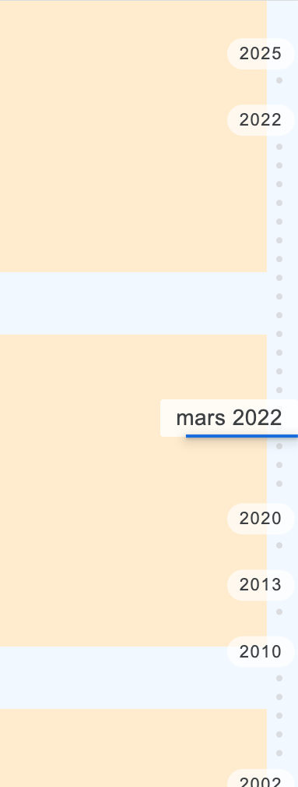

# react-timeline-vertical-navigation

Navigate in time same way as Google Photos.

[timeline-vertical-navigation](https://github.com/relyfe/timeline-vertical-navigation) React.js version

_Built with [StencilJS](https://stenciljs.com/)_

[](https://timeline-vertical-navigation.herokuapp.com/)

## Properties

| Property             | Attribute          | Description | Type               | Default     |
| -------------------- | ------------------ | ----------- | ------------------ | ----------- |
| `darkmode`           | `darkmode`         |             | `boolean`          | `false`     |
| `dates` _(required)_ | `dates`            |             | `Date[] or string` | `undefined` |
| `opaquebackground`   | `opaquebackground` |             | `boolean`          | `false`     |
| `pinned`             | `pinned`           |             | `boolean`          | `false`     |

## Events

| Event          | Description | Type                |
| -------------- | ----------- | ------------------- |
| `dateSelected` |             | `CustomEvent<Date>` |

## Methods

`updateSelectedDate(date: Date) => void`

## [Example](https://github.com/alumbo/react-timeline-vertical-navigation-example)

For the demo, there is an "ItemsGrid" component you can find in source, this is an example of what your scrollable component could be.

```jsx
import React from "react";
import {
  ItemsGrid,
  TimelineVerticalNavigation,
} from "react-timeline-vertical-navigation";

function App() {
  const getRandomDate = () => {
    const start = new Date(2000, 0, 1);
    const end = new Date();
    return new Date(
      start.getTime() + Math.random() * (end.getTime() - start.getTime())
    );
  };
  const dates = [];
  for (let i = 0; i < 50; i++) {
    dates.push(getRandomDate());
  }
  const timelineVerticalNavigation = React.createRef();
  const itemsGrid = React.createRef();
  return (
    <>
      <TimelineVerticalNavigation
        ref={timelineVerticalNavigation}
        dates={dates}
        onDateSelected={(event) => {
          itemsGrid.current.scrollToDate(event.detail);
        }}
      />
      <ItemsGrid
        ref={itemsGrid}
        dates={dates}
        onScrolledToDate={(event) => {
          const firstDateVisible = event.detail;
          timelineVerticalNavigation.current.updateSelectedDate(
            firstDateVisible
          );
        }}
      />
    </>
  );
}

export default App;
```

### [Online demo](https://timeline-vertical-navigation.herokuapp.com/)
